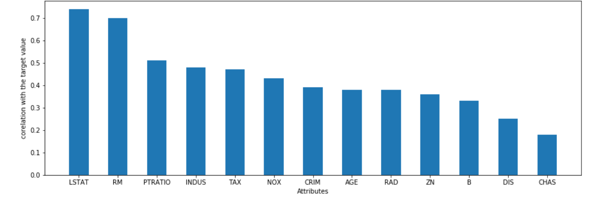
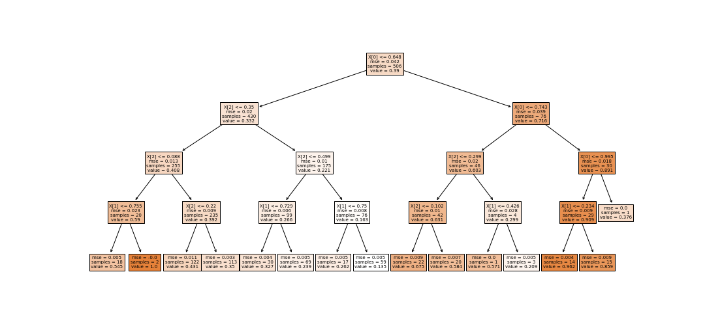

# Boston House Price Prediction
Preticting the price of the houses in Boston.Data is available in scikit-learn library or you can get it from <a href="https://www.kaggle.com/schirmerchad/bostonhoustingmlnd">Kaggle</a>.

## Overview
- Data Understanding.
- Data Visualization.
- Feature Selection.
- Model Building.

## DataSet 
Dataset have 13column(features) and 506 rows.Name and Description of each featutre are as follows:-
 - **CRIM**--> per capita crime rate by town
- **ZN**--> proportion of residential land zoned for lots over 25,000 sq.ft.
- **INDUS**-->proportion of non-retail business acres per town
- **CHAS**--> Charles River dummy variable (= 1 if tract bounds river; 0 otherwise)
- **NOX**-->nitric oxides concentration (parts per 10 million)
- **RM**-->average number of rooms per dwelling
- **AGE**--> proportion of owner-occupied units built prior to 1940
- **DIS**--> weighted distances to five Boston employment centres
- **RAD**-->index of accessibility to radial highways
- **TAX**-->full-value property-tax rate per $10,000
- **PTRATIO**-->pupil-teacher ratio by town
- **B**--> 1000(Bk - 0.63)^2 where Bk is the proportion of blacks by town
- **LSTAT**-->% lower status of the population
- **MEDV**-->Median value of owner-occupied homes in $1000's

## Features Used in Prediction

- RM: average number of rooms per dwelling.
- LSTAT: percentage of population considered lower status.
- PTRATIO: pupil-student ratio by town.

## Algorithm
- Linear Regression(r2 score=0.65)
- Ridge Regression(r2 score=0.66)
- DecisionTree Regressor(r2 score=0.87)

